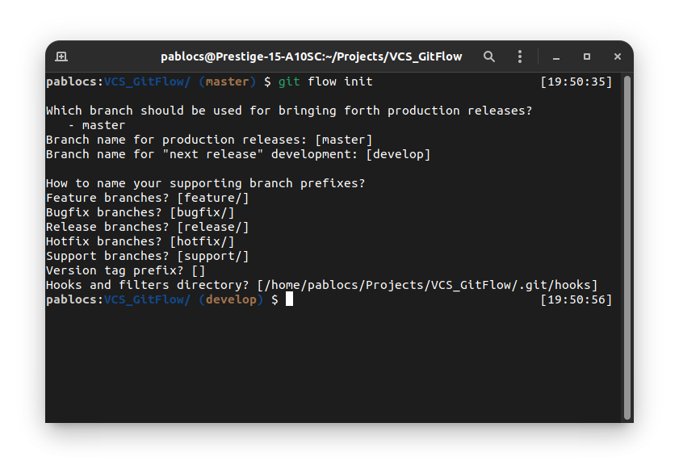
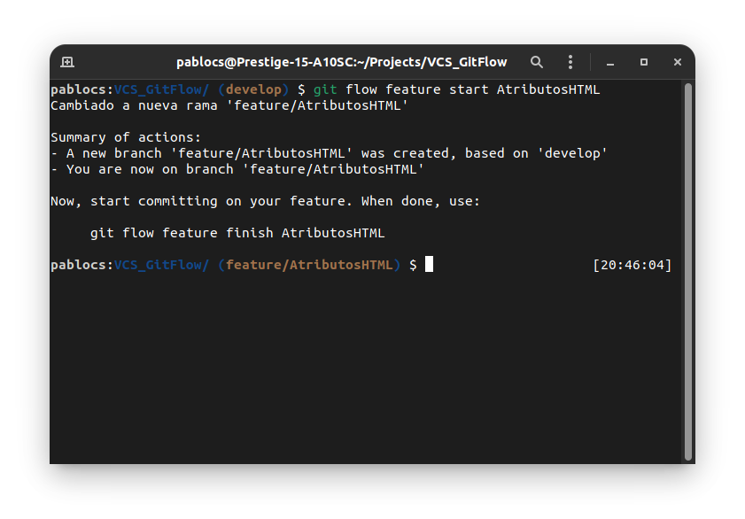
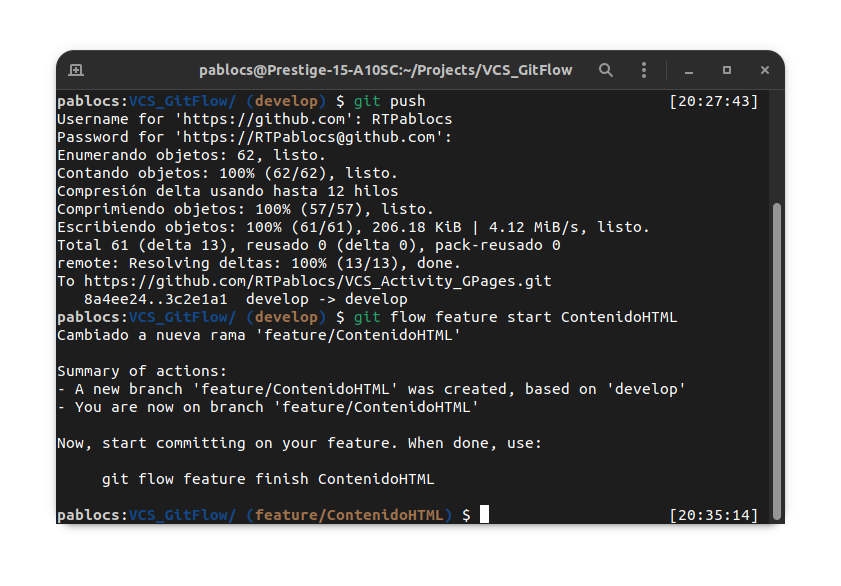
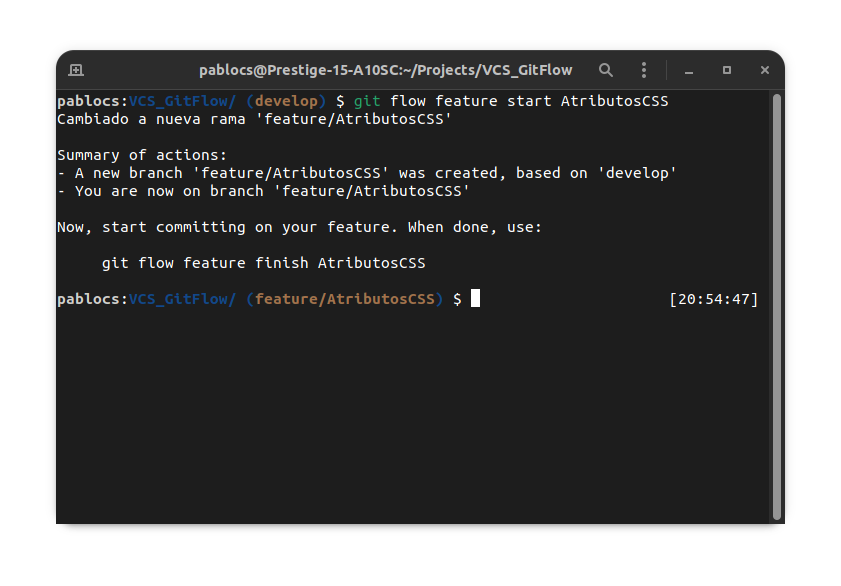
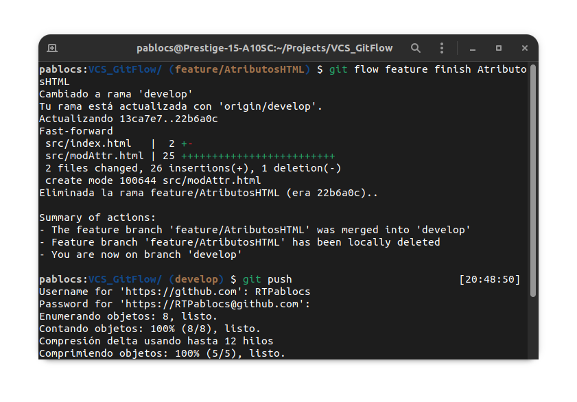
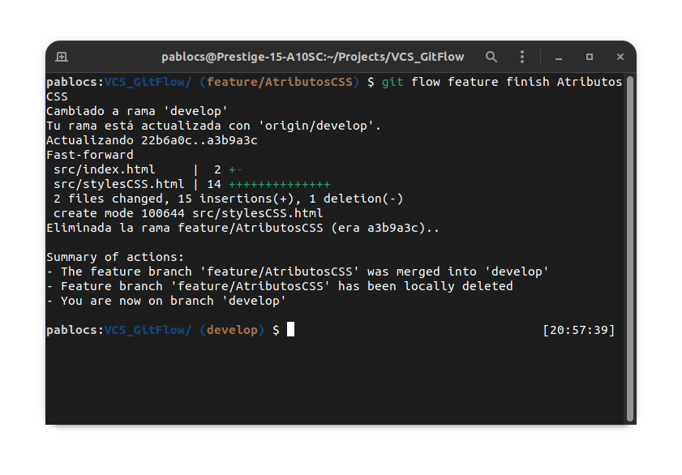
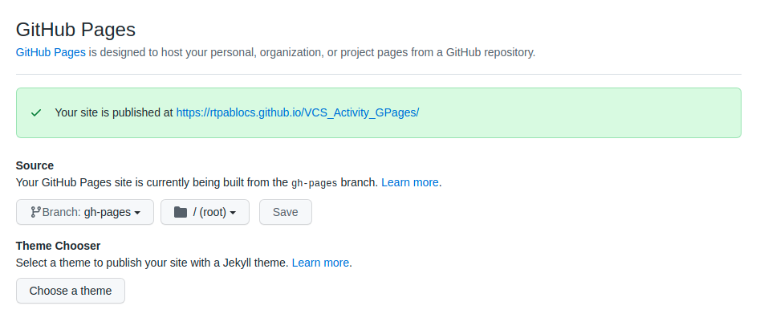

# Git 
Git es un software de control de versiones diseñado por Linus Torvalds, pensando en la eficiencia, la confiabilidad y compatibilidad del mantenimiento de versiones de aplicaciones cuando estas tienen un gran número de archivos de código fuente. Su propósito es llevar registro de los cambios en archivos de computadora incluyendo coordinar el trabajo que varias personas realizan sobre archivos compartidos en un repositorio de código.

# Gitflow
Gitflow es un modelo alternativo de creación de ramas en Git en el que se utilizan ramas de función y varias ramas principales. Fue Vincent Driessen en nvie quien lo publicó por primera vez y quien lo popularizó. En comparación con el desarrollo basado en troncos, Gitflow tiene diversas ramas de más duración y mayores confirmaciones. Según este modelo, los desarrolladores crean una rama de función y retrasan su fusión con la rama principal del tronco hasta que la función está completa. Estas ramas de función de larga duración requieren más colaboración para la fusión y tienen mayor riesgo de desviarse de la rama troncal. También pueden introducir actualizaciones conflictivas.

Gitflow puede utilizarse en proyectos que tienen un ciclo de publicación programado, así como para la práctica recomendada de DevOps de entrega continua. Este flujo de trabajo no añade ningún concepto o comando nuevo, aparte de los que se necesitan para el flujo de trabajo de ramas de función. Lo que hace es asignar funciones muy específicas a las distintas ramas y definir cómo y cuándo deben estas interactuar. Además de las ramas de función, utiliza ramas individuales para preparar, mantener y registrar publicaciones. Por supuesto, también puedes aprovechar todas las ventajas que aporta el flujo de trabajo de ramas de función: solicitudes de incorporación de cambios, experimentos aislados y una colaboración más eficaz.

# Instalación de Gitflow
Para sistemas basados en Debian:

    apt install gitflow

# Uso de gitflow
Para inicialización del repositorio

    git init && git flow init

Este último comando nos creará los prefijos de todas las ramas para poder situarse a la hora de trabajar con las siguientes

## Uso de features

Las features, son cada pequeña característica que nuestra aplicación va a disponer, y podremos crear tantas como queramos, solo tenemos que tener en cuenta que estas ramas son temporales, es decir que cada vez que terminemos una feature, estas se fusionarán con la rama develop y se borrarán

    git flow feature start <nombre>

### Finalización de features
    git flow feature finish <nombre>

## Uso de releases
Las Releases, son las ramas con las que gitflow etiqueta los cambios que deseemos, sus ramas empezarán por `releases/nombre>` y estas son en las que se hacen los últimos cambios para lanzamientos, mediante los comandos 

    git flow release start <version> || git flow release finish <version>

**¡Muy importante! para subir las releases al repositorio utilizaremos 

    git push --tags

# Uso de Github Pages
Para utilizar GH Pages, deberemos ir a configuración del repositorio y pinchar en Pages, para luego habilitarlas, esta acción nos creará una rama con la que podremos colgar nuestra documentación en el directorio /docs, también podremos elegir un tema, etc...

Para acceder a esta page, utilizaremos la siguiente url: `https://<githubUsername>.github.io/<repoName>`
y podremos ver nuestro contenido de la carpeta que seleccionemos